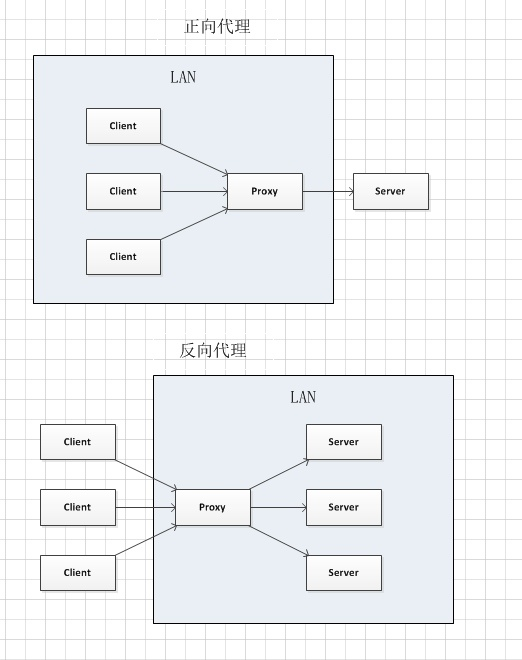

# 名词、概念、术语

## B
##### BS架构、CS架构
>C/S又称Client/Server或客户/服务器模式。服务器通常采用高性能的PC、工作站或小型机，并采用大型数据库系统，如Oracle、Sybase、Informix或 SQL Server。客户端需要安装专用的客户端软件。
>
>B/Ｓ 是Brower/Server的缩写，客户机上只要安装一个浏览器（Browser），如Netscape Navigator或Internet Explorer，服务器安装Oracle、Sybase、Informix或 SQL Server等数据库。浏览器通过Web Server 同数据库进行数据交互。

[BS架构和CS架构的优缺点](http://blog.csdn.net/fightfaith/article/details/50392301)

Tags: 架构

## S

##### 数据落地&数据不落地

> 落地数据：就是被持久化的数据，这种数据一般放在硬盘或是其他的持久化存储设备里，例如：图片、系统日志、在页面上显示的数据以及保存在关系[数据库](http://lib.csdn.net/base/mysql)里的数据等等，落地数据一定会有一个固定的载体，他们不会瞬时消失的。
>
> 不落地数据：一般指存储在内存或者是网络传输里的数据，这些数据是瞬时，使用完毕就会消失，例如：我们在浏览器发送给服务器的请求；从数据库读取出来的一直到页面展示前的数据等等。
>
> “不落地”传输能够满足用户在性能上的要求。

[落地数据和不落地数据](http://blog.csdn.net/youngerchen/article/details/8122359)

Tags: 持久化, 数据

## Z
##### 正向代理&反向代理&透明代理
- 正向代理就是翻墙，要配置代理服务器的地址；
- 反向代理就是CDN，代理服务器就是CDN边缘节点；
- 透明代理就是公司网管，偷偷的监听转发你的网络。

>

[正向代理和反向代理的区别](https://zhuanlan.zhihu.com/p/25423394)

Tags: 代理, CDN, VPN
