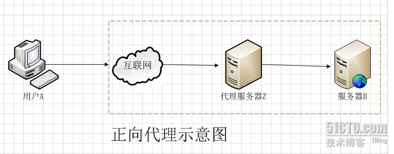
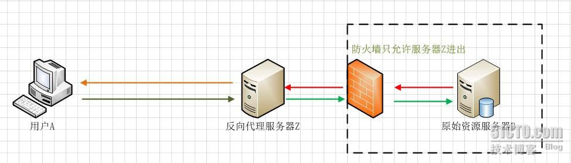
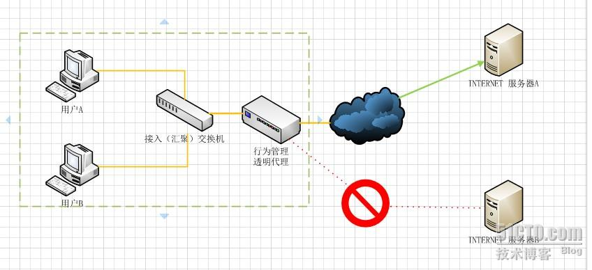

# 名词、概念、术语

## B
##### BS架构、CS架构
>C/S又称Client/Server或客户/服务器模式。服务器通常采用高性能的PC、工作站或小型机，并采用大型数据库系统，如Oracle、Sybase、Informix或 SQL Server。客户端需要安装专用的客户端软件。
>
>B/Ｓ 是Brower/Server的缩写，客户机上只要安装一个浏览器（Browser），如Netscape Navigator或Internet Explorer，服务器安装Oracle、Sybase、Informix或 SQL Server等数据库。浏览器通过Web Server 同数据库进行数据交互。
[BS架构和CS架构的优缺点](http://blog.csdn.net/fightfaith/article/details/50392301)

## S

##### 数据落地&数据不落地

> 落地数据：就是被持久化的数据，这种数据一般放在硬盘或是其他的持久化存储设备里，例如：图片、系统日志、在页面上显示的数据以及保存在关系[数据库](http://lib.csdn.net/base/mysql)里的数据等等，落地数据一定会有一个固定的载体，他们不会瞬时消失的。
>
> 不落地数据：一般指存储在内存或者是网络传输里的数据，这些数据是瞬时，使用完毕就会消失，例如：我们在浏览器发送给服务器的请求；从数据库读取出来的一直到页面展示前的数据等等。
>
> “不落地”传输能够满足用户在性能上的要求。
[落地数据和不落地数据](http://blog.csdn.net/youngerchen/article/details/8122359)

## Z
##### 正向代理&反向代理&透明代理

>正向代理就是代理服务器替代访问方【用户A】去访问目标服务器【服务器B】
>
>反向代理正好与正向代理相反，对于客户端而言代理服务器就像是原始服务器，并且客户端不需要进行任何特别的设置。客户端向反向代理的命名空间(name-space)中的内容发送普通请求，接着反向代理将判断向何处(原始服务器)转交请求，并将获得的内容返回给客户端。
>
>透明代理的意思是客户端根本不需要知道有代理服务器的存在，它改编你的request fields（报文），并会传送真实IP。注意，加密的透明代理则是属于匿名代理，意思是不用设置使用代理了。
>

[图解正向代理、反向代理、透明代理](http://z00w00.blog.51cto.com/515114/1031287)
