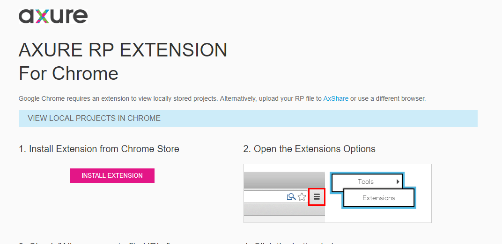

# 如何让Axure中导出的HTML文档无需插件浏览

## 背景
Axure7+导出HTML文档，Win下用Chrome打开，需要安装Chrome插件，否则无法打开，提示安装
但因为很多人无法访问Chrome 插件商店，安装插件不方便，导致易用性差
提示:


## 解决办法

将导出的index.html或start.html文件以下代码删除或注释掉既可

```
 $(window).bind('load', function() {
     if(CHROME_5_LOCAL && !$('body').attr('pluginDetected')) {
         window.location = 'resources/chrome/chrome.html';
     }
 });
```

Tags: Axure, 产品文档
