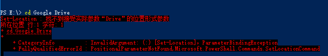

# Powershell 路径含有中文或空格怎么办

在Powershell输入
```
cd E:\Google Drive
```
显示


**原因:如果路径由空格，会被误认为空格后为命令的参数，需要将路径带单引号或双引号包起来**

```
cd 'E:\Google Drive'
```

*路径中有中文字符也一样
```
cd 'E:\Google Drive\调研报告'
```

Tags: PowerShell, cd
